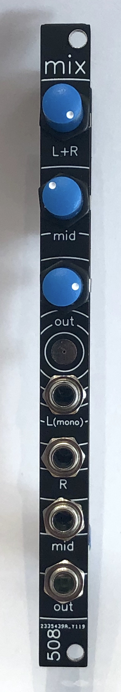

# 2HP Stereo mixer and headphone amplifier

A simple stereo mixer -- it has 1 plain-mono input, a second mono input that becomes a hard-panned left-channel when the third input, a dedicated right channel, is patched into. No pan pots, sorry, it's 2HP. I actually designed it to go with a combination 4-way low-pass gate and stereo panning mixer that I haven't gotten around to uploading here yet.

It has a reasonably decent headphone amplifier IC as its output stage, set to provide enough gain to drive my Sennheisers. 
